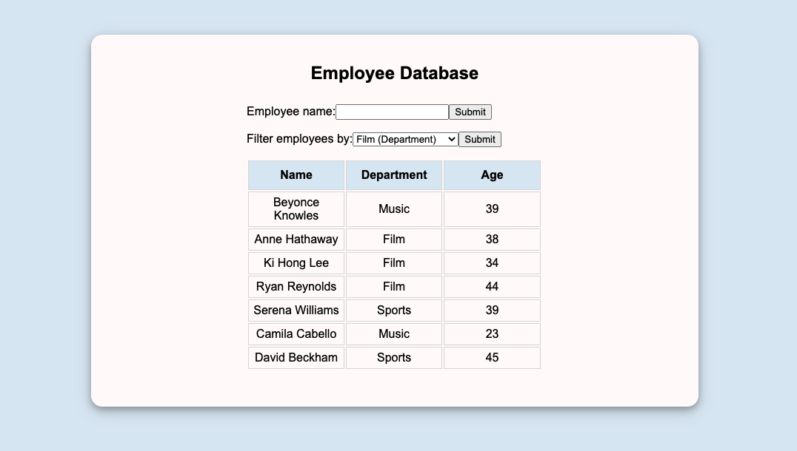

# Employee Search

> React application built to allow users to: display employee data, allow users to search for employee by name, and filter employee by department and age.




### Installing Dependencies

From within the root directory:

```sh
npm install
npm run seed
npm run build
npm run start
```

### Usage

> A user can search all employees by full name or first/last name. If the input name is not found you will recieve a message stating "no employees match your search". A user can sort by different departments along with sorting by age if needed.

### Support

> There are 10 Enzyme tests within the specs folder.

```sh
npm run test
```

### Technologies

> React, Node, Express, MongoDB, Styled-Components, Webpack, Enzyme-Jest

### Author

> Daniel Flores
